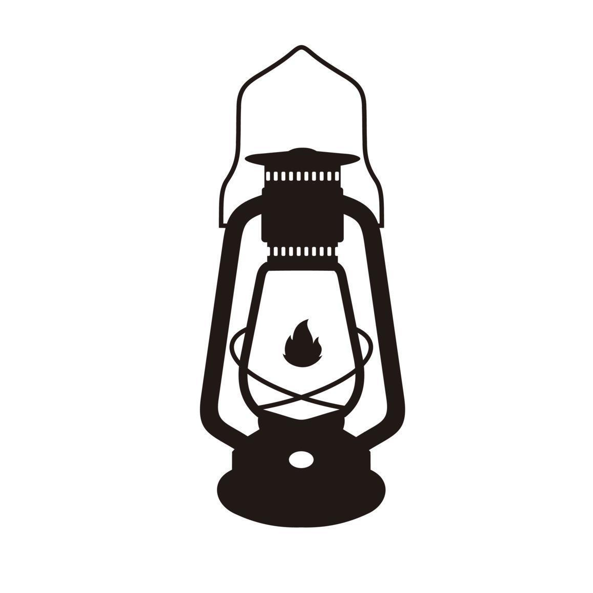
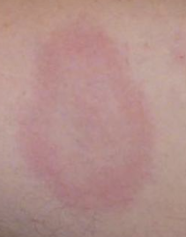
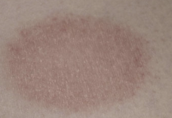

<!-- Improved compatibility of back to top link: See: https://github.com/othneildrew/Best-README-Template/pull/73 -->

<!--
*** Thanks for checking out the Best-README-Template. If you have a suggestion
*** that would make this better, please fork the repo and create a pull request
*** or simply open an issue with the tag "enhancement".
*** Don't forget to give the project a star!
*** Thanks again! Now go create something AMAZING! :D
-->

<!-- PROJECT SHIELDS -->
<!--
*** I'm using markdown "reference style" links for readability.
*** Reference links are enclosed in brackets [ ] instead of parentheses ( ).
*** See the bottom of this document for the declaration of the reference variables
*** for contributors-url, forks-url, etc. This is an optional, concise syntax you may use.
*** https://www.markdownguide.org/basic-syntax/#reference-style-links
-->
[![Contributors][contributors-shield]][contributors-url]
[![Forks][forks-shield]][forks-url]
[![Stargazers][stars-shield]][stars-url]
[![Issues][issues-shield]][issues-url]
[![MIT License][license-shield]][license-url]
[![LinkedIn][linkedin-shield]][linkedin-url]

<!-- PROJECT LOGO -->
 

  

<h3 align="center">LANTERN</h3>

  

    An application to accurately detect Lyme disease!
     
    <a href="https://github.com/TSKoduru/LANTERN"><strong>Explore the docs »</strong></a>
     
     
    <a href="https://github.com/TSKoduru/LANTERN">View Demo</a>
    ·
    <a href="https://github.com/TSKoduru/LANTERN/issues">Report Bug</a>
    ·
    <a href="https://github.com/TSKoduru/LANTERN/issues">Request Feature</a>
    ·
    <a href="">Check out the DEVPOST</a>
  

<!-- TABLE OF CONTENTS -->

  
Table of Contents

  <ol>
    <li>
      <a href="#about-the-project">About The Project</a>
      <ul>
        <li><a href="#background">Background</a></li>
        <li><a href="#some-interesting-statistics">Some interesting statistics</a></li>
      <ul>
        <li><a href="#built-with">Built With</a></li>
      </ul>
    </li>
    <li>
      <a href="#getting-started">Getting Started</a>
    </li>
    <li>
      <a href="#final-thoughts">Final Thoughts</a>
    </li>
    <li><a href="#license">License</a></li>
    <li><a href="#contact">Contact</a></li>
  </ol>

<!-- ABOUT THE PROJECT -->
## About The Project

### Background

Back when I was a young kid, I got bitten by a tick and developed this large, bullseye-shaped rash. Here's what it looks like:

 

  

 
Turns out, that was one of the damning symptoms of Lyme disease. Unfortunately, I wasn't able to get it diagnosed early enough, so I slowly lost control of my arms and legs over about a month. Eventually, I had to go to school in a wheelchair - It was bad.

 
Lyme actually has a pretty effective treatment; The problem is just in it's diagnosis. The rash that I got, though a pretty clear signal of Lyme, is often diagnosed as another type of disease. Here's an example of a rash that looks similar, but isn't Lyme:

 

  

 

So, the goal was to develop a system that could accurately diagnose Lyme disease from a picture of a rash. This updated version of the system takes advantage of the newest in computer vision tech - transformers - To provide even more accurate results with even less data. I'm excited to see where this project goes, and I hope that it can help a lot of people.

Credit where credit is due: I worked with Edward Zhang, a friend of mine, on the first version of this project back in school. He was a huge help - Be sure to check out his insta [here!](https://www.instagram.com/edward_z99/)

## Some interesting statistics

Just so you know the extent of the problem, here are some statistics about Lyme disease:

* [Lyme disease is the most common vector-borne disease in the United States](https://health.ucdavis.edu/conditions/infectious-diseases/vector-borne-diseases)
* [In 2022, over 60,000 new cases of Lyme disease were reported.](https://www.cdc.gov/lyme/data-research/facts-stats/index.html#:~:text=Key%20points,not%20actually%20have%20Lyme%20disease.)
* [The CDC estimates that the actual number of cases is closer to 476,000](https://www.cdc.gov/lyme/data-research/facts-stats/index.html#:~:text=Key%20points,not%20actually%20have%20Lyme%20disease.)
* [Lyme can cause nerve problems, paralysis, meningtitis, or even heart problems.](https://www.pennmedicine.org/for-patients-and-visitors/patient-information/conditions-treated-a-to-z/lyme-disease#:~:text=Numbness%20or%20pain%20in%20the,can%20cause%20lightheadedness%20or%20fainting.)

As you can see, it's a pretty big issue.

(<a href="#readme-top">back to top</a>)

### Built With

* 
* 
* 
* 
* 
* 

(<a href="#readme-top">back to top</a>)

<!-- GETTING STARTED -->
## Getting Started

Hey, thanks for checking out the project! Luckily for you, testing it is pretty easy. I've gone ahead and hosted the project on a public server, so you can check it out [here.]()

(<a href="#readme-top">back to top</a>)

## Final Thoughts

Again, thanks for reading through this! If you have any suggestions, feel free to hit me up. Also, if you can, go vote for my project on devpost [here](https://devpost.com/software/lantern-lyme-disease-diagnosis)!

(<a href="#readme-top">back to top</a>)

<!-- LICENSE -->
## License

Distributed under the GNU General Public License v3.0. See `LICENSE` for more information.

(<a href="#readme-top">back to top</a>)

<!-- CONTACT -->
## Contact

Teja koduru - [@TJKoduru](https://twitter.com/TJKoduru) - tkoduru@umich.edu

(<a href="#readme-top">back to top</a>)

<!-- MARKDOWN LINKS & IMAGES -->
<!-- https://www.markdownguide.org/basic-syntax/#reference-style-links -->
[contributors-shield]: https://img.shields.io/github/contributors/TSKoduru/LANTERN.svg?style=for-the-badge
[contributors-url]: https://github.com/TSKoduru/LANTERN/graphs/contributors
[forks-shield]: https://img.shields.io/github/forks/TSKoduru/LANTERN.svg?style=for-the-badge
[forks-url]: https://github.com/TSKoduru/LANTERN/network/members
[stars-shield]: https://img.shields.io/github/stars/TSKoduru/LANTERN.svg?style=for-the-badge
[stars-url]: https://github.com/TSKoduru/LANTERN/stargazers
[issues-shield]: https://img.shields.io/github/issues/TSKoduru/LANTERN.svg?style=for-the-badge
[issues-url]: https://github.com/TSKoduru/LANTERN/issues
[license-shield]: https://img.shields.io/github/license/TSKoduru/LANTERN.svg?style=for-the-badge
[license-url]: https://github.com/TSKoduru/LANTERN/blob/master/LICENSE.txt
[linkedin-shield]: https://img.shields.io/badge/-LinkedIn-black.svg?style=for-the-badge&logo=linkedin&colorB=555
[linkedin-url]: https://linkedin.com/in/TSKoduru
[3D-View-Top]: assets/3D-View-Top.png
[Next.js]: https://img.shields.io/badge/next.js-000000?style=for-the-badge&logo=nextdotjs&logoColor=white
[Next-url]: https://nextjs.org/
[React.js]: https://img.shields.io/badge/React-20232A?style=for-the-badge&logo=react&logoColor=61DAFB
[React-url]: https://reactjs.org/
[Vue.js]: https://img.shields.io/badge/Vue.js-35495E?style=for-the-badge&logo=vuedotjs&logoColor=4FC08D
[Vue-url]: https://vuejs.org/
[Angular.io]: https://img.shields.io/badge/Angular-DD0031?style=for-the-badge&logo=angular&logoColor=white
[Angular-url]: https://angular.io/
[Svelte.dev]: https://img.shields.io/badge/Svelte-4A4A55?style=for-the-badge&logo=svelte&logoColor=FF3E00
[Svelte-url]: https://svelte.dev/
[Laravel.com]: https://img.shields.io/badge/Laravel-FF2D20?style=for-the-badge&logo=laravel&logoColor=white
[Laravel-url]: https://laravel.com
[Bootstrap.com]: https://img.shields.io/badge/Bootstrap-563D7C?style=for-the-badge&logo=bootstrap&logoColor=white
[Bootstrap-url]: https://getbootstrap.com
[JQuery.com]: https://img.shields.io/badge/jQuery-0769AD?style=for-the-badge&logo=jquery&logoColor=white
[JQuery-url]: https://jquery.com 
